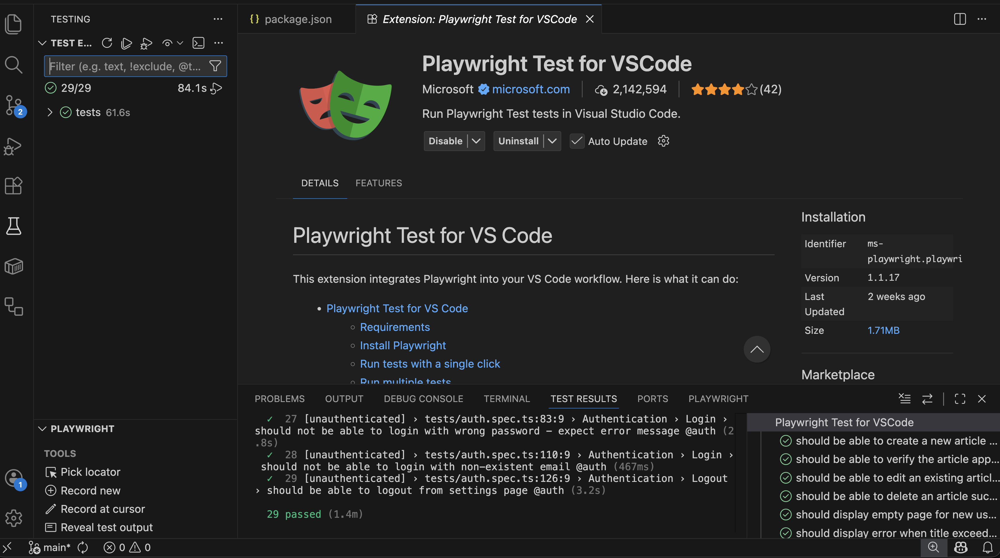
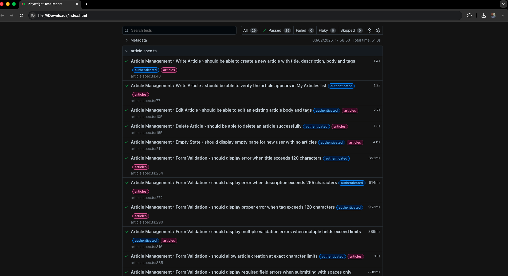

# QA Automation Project

Playwright + TypeScript test automation framework for the practical challenge. 

## Project Description

This project contains e2e tests for the RealWorld application provided for this challenge. The project was downloaded from `https://github.com/NemTam/realworld-django-rest-framework-angular` and added as a part of the resolution in order to make it simple. 

- **Frontend:** Angular 18 at `http://localhost:4200`
- **Backend:** Django REST API at `http://localhost:8000/api`

The solution of this framework uses the Page Object Model pattern with TypeScript, while doing the tests, I've added a couple of different approaches in the POM based on my experience. It includes tests for:
- User authentication (sign-up, login)
- Article management (create, edit, delete)
- Comments (add, delete)
- Follow/Feed functionality
- Tag filtering

## How to Install This Project

### Prerequisites

#### Node.js

Having Node.js installed is mandatory to run this project. Download and install from [nodejs.org](https://nodejs.org/en/download/).

After installation, open a terminal and verify the version (check `.nvmrc` for the required version - must be >= v20):

```bash
# If using nvm, switch to the project's node version
nvm use

# Verify Node.js version
node -v

# Verify npm version
npm -v
```

#### Docker

Docker is required to run the target application. Install [Docker Desktop](https://www.docker.com/products/docker-desktop/) for your operating system or install it in your CLI.

After installation, verify Docker is running:

```bash
# Check Docker is installed and running
docker --version

# Check Docker Compose is available
docker compose version

# Verify Docker daemon is running
docker ps
```

If `docker ps` returns an error, ensure Docker Desktop is started.

#### Git

Git is required to clone the repository. Download from [git-scm.com](https://git-scm.com/downloads) if not already installed.

```bash
git --version
```

### If you are using VSCode I recommend: Playwright Test for VSCode

For a better development experience, install the [Playwright Test for VSCode](https://marketplace.visualstudio.com/items?itemName=ms-playwright.playwright) extension. It provides:

- Test explorer with run/debug capabilities
- Live test results in the editor
- Browser picker and headed mode toggle
- Trace viewer integration
- Pick locator tool for element selection



### Clone and Setup

```bash
# Clone the repository
## https://github.com/willcoliveira/qa-kra-real-assessment
git clone git@github.com:willcoliveira/qa-kra-real-assessment.git
cd qa-kra-real-assessment

# Use the correct Node version (min 20)
# if you don't have nvm installed, please download it.
nvm use

# Install dependencies
npm install

# Install Playwright browsers
npm run pw:setup
```

Or use the Makefile:

```bash
make install
```

## How to Run This Project CLI

### Start the Application

First, start the target application:

```bash
# Start the application
make app-up

# Wait for containers to be ready (check logs)
make app-logs

# Verify the application is running
# Frontend: http://localhost:4200
# Backend: http://localhost:8000/api
```

## How to Run the Tests Using Playwright Interface

```bash
# Run with Playwright UI
npm run test:ui

# Or using Makefile
make test-ui

# Or using the VSCode extension as described above
```

### How to Run Tests using npm

```bash
# Run all tests
npm test

# Run specific test suites
npm run test:auth      # Authentication tests
npm run test:articles  # Article tests
npm run test:comments  # Comment tests
npm run test:feed      # Follow/Feed tests
npm run test:tags      # Tag filter tests

# Run tests with browser visible
npm run test:headed

# Run tests in debug mode
npm run test:debug
```

### How to Run the tests using makefile and docker

```bash
make test           # Run all tests
make test-headed    # Run with browser visible
make test-auth      # Run auth tests only
make test-articles  # Run article tests only
make test-comments  # Run comment tests only
make test-feed      # Run follow/feed tests only
make test-tags      # Run tag tests only
```

### Stop the Application

```bash
make app-down
```

## How to Run the Tests Using Docker only

### Build the Docker Image

```bash
make docker-build
```

### Run Tests in Docker

```bash
# Make sure the application is running first
make app-up

# Run tests in Docker
make docker-test
```

The test reports will be available in the `playwright-report/` directory.

## How to Analyse the Test Results

### View HTML Report

```bash
# Open the latest HTML report using Makefile (macOS/Linux)
make report

# Or manually open the latest report
open playwright-report/$(ls -t playwright-report | head -1)/index.html
```

The report includes:
- Test results summary
- Detailed test steps
- Screenshots (on failure)
- Trace files (when enabled)

### Report Location

- **Local runs:** `playwright-report/{date}/index.html`
- **CI runs:** `playwright-report/index.html` (available as downloadable artifact)



## Caveats and Linters Validations

### ESLint

```bash
# Run linter
npm run lint

# Fix auto-fixable issues
npm run lint:fix
```

### Prettier

```bash
# Format code
npm run format
```

### Configuration Files

- `.eslintrc.json` - ESLint rules
- `.prettierrc` - Prettier formatting rules
- `tsconfig.json` - TypeScript configuration

## Test Plan

### Test Scenarios (29 tests)

| Suite | Test Case | Tag |
|-------|-----------|-----|
| **Auth - Sign Up** | | |
| Auth | Register new user successfully | @auth |
| Auth | Register with existing email shows error | @auth |
| **Auth - Login** | | |
| Auth | Login with valid credentials successfully | @auth |
| Auth | Login with wrong password shows error | @auth |
| Auth | Login with non-existent email shows error | @auth |
| **Auth - Logout** | | |
| Auth | Logout from settings page | @auth |
| **Article - Write** | | |
| Article | Create article with title, description, body and tags | @articles |
| Article | Verify article appears in My Articles list | @articles |
| **Article - Edit** | | |
| Article | Edit existing article body and tags | @articles |
| **Article - Delete** | | |
| Article | Delete article successfully | @articles |
| **Article - Empty State** | | |
| Article | Display empty page for new user with no articles | @articles |
| **Article - Form Validation** | | |
| Article | Display error when title exceeds 120 characters | @articles |
| Article | Display error when description exceeds 255 characters | @articles |
| Article | Display error when tag exceeds 120 characters (BUG-002) | @articles |
| Article | Display multiple validation errors when fields exceed limits | @articles |
| Article | Allow article creation at exact character limits | @articles |
| Article | Display required field errors when submitting spaces only | @articles |
| Article | Display error when creating article with duplicate title | @articles |
| Article | Publish button disabled when required fields are empty | @articles |
| **Comments** | | |
| Comments | Add comment to article | @comments |
| Comments | Delete comment from article | @comments |
| Comments | Display all comments on an article | @comments |
| **Follow/Feed** | | |
| Follow | Follow another user from their profile | @feed |
| Follow | See followed user's article in Your Feed tab | @feed |
| Follow | Unfollow a user | @feed |
| **Tags** | | |
| Tags | Filter articles by clicking a tag in Global Feed | @tags |
| Tags | Verify only articles with selected tag are displayed | @tags |
| Tags | Display article tags in the feed | @tags |
| Tags | Return to global feed after tag filter | @tags |

### Bug Findings

Please check the [docs/BUGS.md](docs/BUGS.md) for documented issues found during testing and during the development of this solution.

## Project Structure

```
qa-kra-real-assessment/
├── realworld-django-rest-framework-angular/   # Target application
├── src/
│   ├── config/
│   │   └── config.ts                          # YAML config loader
│   ├── pages/
│   │   ├── BasePage.ts
│   │   ├── LoginPage.ts
│   │   ├── RegisterPage.ts
│   │   ├── HomePage.ts
│   │   ├── EditorPage.ts
│   │   ├── ArticlePage.ts
│   │   └── ProfilePage.ts
│   ├── fixtures/
│   │   └── test.fixture.ts                    # Custom test fixtures
│   └── utils/
│       ├── random.ts                          # Random data generators
│       └── auth.helper.ts                     # Session management
├── tests/
│   ├── auth.spec.ts                           # Authentication tests
│   ├── article.spec.ts                        # Article CRUD tests
│   ├── comments.spec.ts                       # Comment tests
│   ├── follow-feed.spec.ts                    # Follow/Feed tests
│   └── tags.spec.ts                           # Tag filter tests
├── config/
│   └── settings.yaml                          # Test configuration
├── docs/
│   └── BUGS.md                                # Bug findings
├── .github/
│   └── workflows/
│       └── tests.yml                          # GitHub Actions CI
├── playwright.config.ts
├── Dockerfile
├── Makefile
├── package.json
└── tsconfig.json
```

## CI/CD

The project contains a GitHub Actions workflow that runs on:
- Push to `main` branch
- Pull requests to `main` branch

### Making Tests Required for PRs

To enforce that all tests must pass before merging a PR:

1. Go to your GitHub repository → **Settings** → **Branches**
2. Click **Add branch protection rule**
3. Set **Branch name pattern** to `main`
4. Check **Require status checks to pass before merging**
5. Search and select **E2E Tests** from the status checks list
6. Optionally check **Require branches to be up to date before merging**
7. Click **Create** or **Save changes**

This ensures PRs cannot be merged until all Playwright tests pass.

## Environment Variables

| Variable | Description | Default |
|----------|-------------|---------|
| `BASE_URL` | Frontend URL | `http://localhost:4200` |
| `API_URL` | Backend API URL | `http://localhost:8000/api` |
| `CI` | CI environment flag | - |

## Final considerations
- I set up the project and added a couple of good practices from my experience and previous work.
- When adding the Docker execution, I found some issues due to the container browser, and since I didn’t have the chance to properly find the root cause, the page refresh helped a lot for a clean execution.
- I used AI to generate the docs and the bug report so I could focus on the implementation details.
- You can find similar resolutions in [my GitHub repositories](https://github.com/willcoliveira?tab=repositories) using the same structure for the POM, docs, reports, Docker, Make, and CI. This content came from my background and previous experiences and this is the approach I usually take for the projects I work on.

## License
MIT
